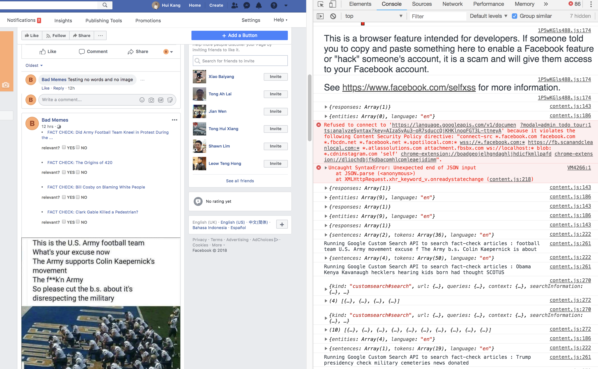

# https://tinyurl.com/badmemez

# Disclaimer
We are not liable for any damages to the maximum extent provided by law.

# Installation Instructions
Download our chrome extension https://github.com/tonghuikang/fb-sg-hack/raw/master/fake_news_identifier/fake_news_identifier.zip  
Open Google Chrome and go to the extensions page chrome://extensions and drop the zip file into it.  

Disable all of your other Chrome Extension for maximum demostration reliablitiy.  

Try it out on these sites:  
Our page with a single meme: https://www.facebook.com/One-Bad-Meme-443026566101583/  
Our page with multiple memes: https://www.facebook.com/Bad-Memes-1923743867919531/  
Snopes Public Facebook Group https://www.facebook.com/groups/441333919315986/

# Development Process
People to blame if the code is horrible (we only learnt Javascript last week): https://github.com/tonghuikang/fb-sg-hack/blame/master/fake_news_identifier/content.js  
Extended write-up on initial plans: https://github.com/tonghuikang/fb-sg-hack/blob/master/README.md  
